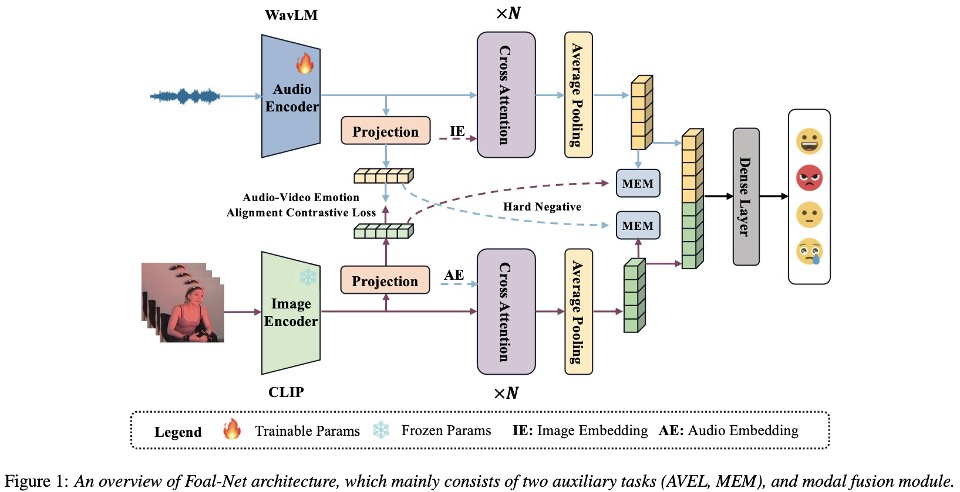
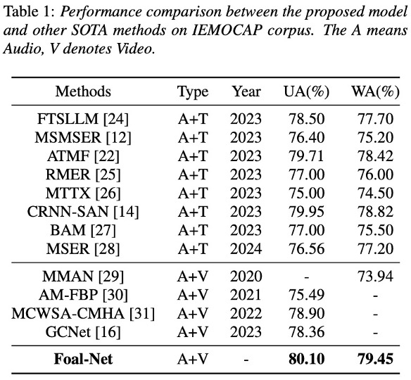
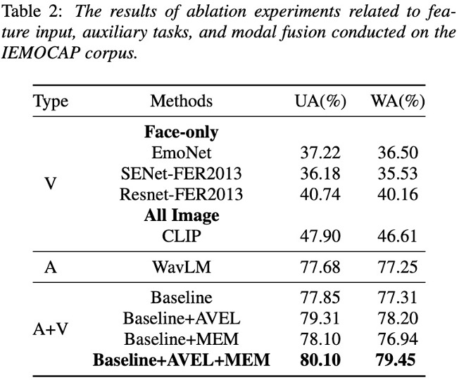

# Enhancing Modal Fusion by Alignment and Label Match for Multimodal Emotion Recognition

> [Qifei Li](), [Yingming Gao](), [Yuhua Wen](), [Cong wang]() and [Ya Li]()<br>
> School of Aritificial Intelligence, Beijing University of Posts and Telecommunications<br>

## 📰 News
**[2024.09.24]** update the codes. 


## ✨ Overview



Abstract:
To address the limitation in multimodal emotion recognition (MER) performance arising from inter-modal information fusion, we propose a novel MER framework based on multitask learning where fusion occurs after alignment, called Foal-net. The framework is designed to enhance the effectiveness of modality fusion and includes two auxiliary tasks: audio-video emotion alignment (AVEL) and cross-modal emotion label matching (MEM) First, AVEL achieves alignment of emotional information in audio-video representations through contrastive learning. Then, a modal fusion network integrates the aligned features. Meanwhile, MEM assesses whether the emotions of the current sample pair are the same, providing assistance for modal information fusion and guiding the model to focus more on emotional information. The experimental results conducted on IEMOCAP corpus show that Foal-Net outperforms the state-of-the-art methods and emotion alignment is necessary before modal fusion.


## 🚀 Main Results

<p align="center">
   <br>
   Comparison with state-of-the-art SER methods on IEMOCAP datasets.
</p>

<p align="center">
   <br>
   Ablation Experiments.
</p>


## 🔨 Installation

Main prerequisites:

* `Python 3.8`
* `PyTorch`
* `transformers`
* `scikit-learn, scipy, pandas, numpy`
* `accelerate`
* `soundfile`
* `librosa`

If some are missing, please refer to [requirements.yml](./requirements.yml) for more details.


## ➡️ File Description

1. dataloader.py. The file includes the method for loading datasets.

2. model.py  All models in this filse.

3. train.py. The training approach for Foal-net.

4. optims.py. The schedulers are in this file.

## 📍 Data Preparation
1. You should prepare training source, such as train.scp, valid.scp.

    Specifically, the format of `*.scp` file is typically like this:

    ```
    wave_index1 dataset_root/audio_1 label_1
    wave_index2 dataset_root/audio_2 label_2
    wave_index3 dataset_root/audio_3 label_3
    ...
    wave_indexN dataset_root/audio_N label_N
    ```

    An example of [train.scp] is shown as follows:

    ```
    Ses03F_impro01_F002 /home/samba/public/Datasets/IEMOCAP/IEMOCAP_full_release/Session3/sentences/wav/Ses03F_impro01/Ses03F_impro01_F002.wav neu
    Ses03F_impro01_M001 /home/samba/public/Datasets/IEMOCAP/IEMOCAP_full_release/Session3/sentences/wav/Ses03F_impro01/Ses03F_impro01_M001.wav neu
    Ses03F_impro01_M002 /home/samba/public/Datasets/IEMOCAP/IEMOCAP_full_release/Session3/sentences/wav/Ses03F_impro01/Ses03F_impro01_M002.wav neu
    Ses03F_impro01_M003 /home/samba/public/Datasets/IEMOCAP/IEMOCAP_full_release/Session3/sentences/wav/Ses03F_impro01/Ses03F_impro01_M003.wav neu
    ```

## ⤴️ How to use?

- Train

    ```
    accelerate launch train.py --train_src="/path/session5_train.scp" --test_src="/path/session5_valid.scp"
    ```

## ☎️ Contact 

If you have any questions, please feel free to reach me out at `liqifei@bupt.edu.cn`.

## 👍 Acknowledgements

Thanks for the efforts of all the authors..

## ✏️ Citation

If you think this project is helpful, please feel free to leave a star⭐️ and cite our paper:

```
@inproceedings{li24z_interspeech,
  title     = {Enhancing Modal Fusion by Alignment and Label Matching for Multimodal Emotion Recognition},
  author    = {Qifei Li and Yingming Gao and Yuhua Wen and Cong Wang and Ya Li},
  year      = {2024},
  booktitle = {Interspeech 2024},
  pages     = {4663--4667},
  doi       = {10.21437/Interspeech.2024-1462},
  issn      = {2958-1796},
}
```
